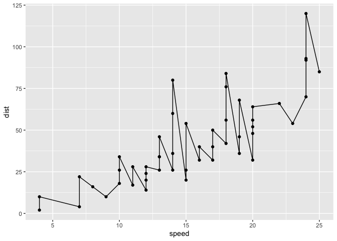
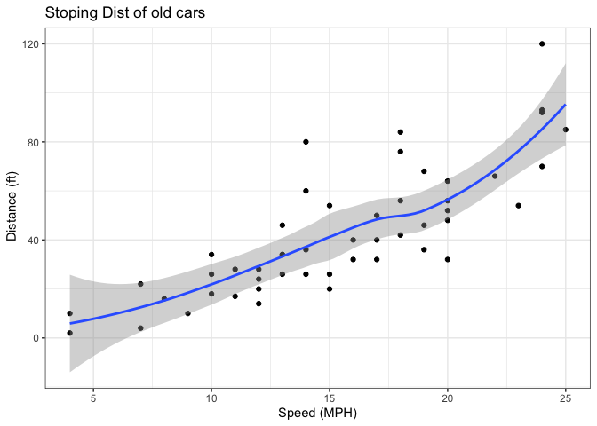
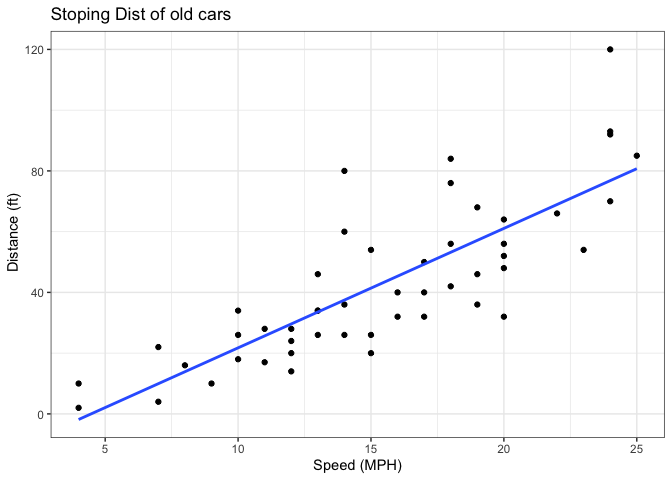
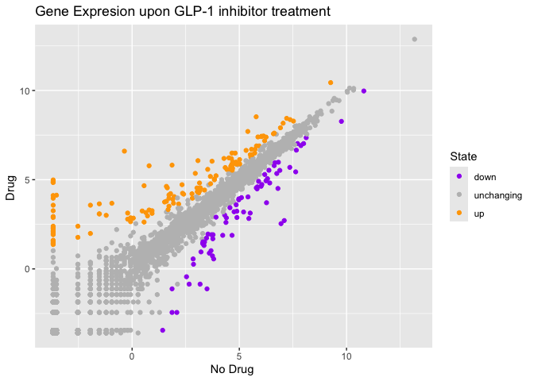
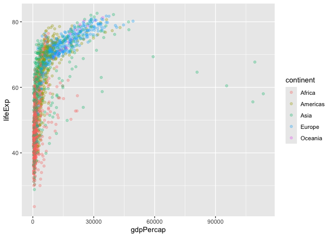
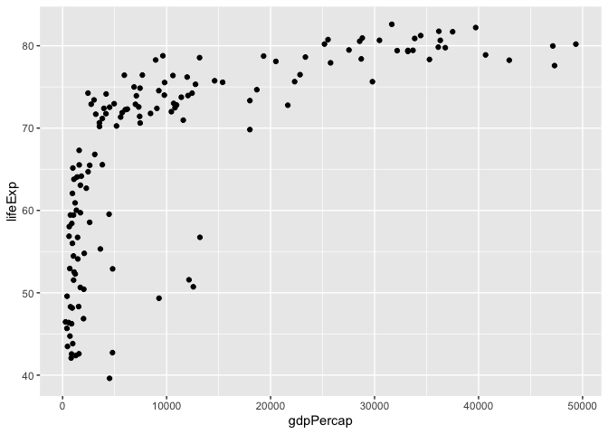
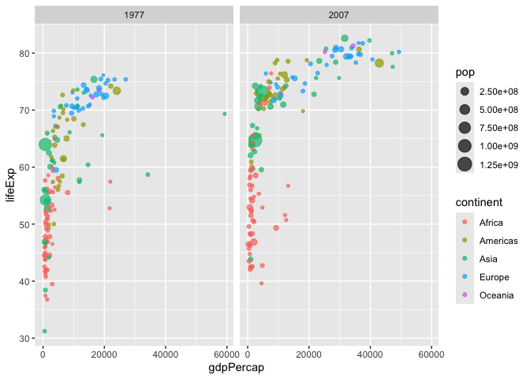

# Class05: Data Viz with ggplot2
Julissa Gonzalez (PID:A18495188)

- [Background](#background)
- [Add some custom features](#add-some-custom-features)
- [Gene expression Figure](#gene-expression-figure)
- [Expression Chnages](#expression-chnages)

## Background

There are many graphic systems in R for making plots and figures These
include so-called *“base R” graphics* like the `plot()` function and on
packages like**ggplot2**.

Let’s compare how we make a simple figure with these two systems:

We can use the in-built `cars` dataset:

``` r
head(cars)
```

      speed dist
    1     4    2
    2     4   10
    3     7    4
    4     7   22
    5     8   16
    6     9   10

``` r
plot(cars)
```


Before I can use ggplot I need to install it on my computer. To do this
we can use the function `install.packages("ggplot2")` \>**N.B** We never
run `instal.packages()` in our quarto doc we run it once only in our R
console as it would re-install the package every time we render out
quarto report once installed we need to load up the package into our R
brain:

``` r
library(ggplot2)
```

The main function in the **ggplot2** package is called \`ggplot()

``` r
ggplot(cars)
```


Every ggplot has at least 3 layers: the **data** (a data.frame of the
stuff we want to plot) the **aes** thetics(how the data maps to the
plot), the **geom** layer (how you want the plot drawn, e.g. points,
lines, etc.)

``` r
ggplot(cars)+
  aes(x=speed, y=dist)+
  geom_point()
```


## Add some custom features

Lets add a trend line that shows the relationship between speed and
distance.

``` r
ggplot(cars)+
  aes(x=speed, y=dist)+
  geom_point() +
  geom_line()
```



``` r
ggplot(cars)+
  aes(x=speed, y=dist)+
  geom_point() +
  geom_smooth()+
  theme_bw()+
  labs(titles="Stoping Dist of old cars",
       x="Speed (MPH)",
       y= " Distance (ft)")
```

    Ignoring unknown labels:
    • titles : "Stoping Dist of old cars"
    `geom_smooth()` using method = 'loess' and formula = 'y ~ x'



Q. Can you make the `geom_smooth()`function produce a linear

``` r
ggplot(cars)+
  aes(x=speed, y=dist)+
  geom_point() +
  labs(titles="Stoping Dist of old cars",
       x="Speed (MPH)",
       y= " Distance (ft)")+
   geom_smooth(method="lm", se=FALSE)+
  theme_bw()
```

    Ignoring unknown labels:
    • titles : "Stoping Dist of old cars"
    `geom_smooth()` using formula = 'y ~ x'



## Gene expression Figure

``` r
url <- "https://bioboot.github.io/bimm143_S20/class-material/up_down_expression.txt"
genes <- read.delim(url)
head(genes)
```

            Gene Condition1 Condition2      State
    1      A4GNT -3.6808610 -3.4401355 unchanging
    2       AAAS  4.5479580  4.3864126 unchanging
    3      AASDH  3.7190695  3.4787276 unchanging
    4       AATF  5.0784720  5.0151916 unchanging
    5       AATK  0.4711421  0.5598642 unchanging
    6 AB015752.4 -3.6808610 -3.5921390 unchanging

first plot attempt

``` r
ggplot(genes)+
  aes(x=Condition1, y=Condition2, col=State)+
  geom_point()
```


``` r
ggplot(genes)+
  aes(x=Condition1, y=Condition2, col=State)+
  geom_point()+
  scale_colour_manual(values=c("purple","grey","orange"))+  labs(x="No Drug ",
      y="Drug ",
      title="Gene Expresion upon GLP-1 inhibitor treatment")
```



## Expression Chnages

``` r
#File location 
url <- "https://raw.githubusercontent.com/jennybc/gapminder/master/inst/extdata/gapminder.tsv"

gapminder <- read.delim(url)
head(gapminder)
```

          country continent year lifeExp      pop gdpPercap
    1 Afghanistan      Asia 1952  28.801  8425333  779.4453
    2 Afghanistan      Asia 1957  30.332  9240934  820.8530
    3 Afghanistan      Asia 1962  31.997 10267083  853.1007
    4 Afghanistan      Asia 1967  34.020 11537966  836.1971
    5 Afghanistan      Asia 1972  36.088 13079460  739.9811
    6 Afghanistan      Asia 1977  38.438 14880372  786.1134

> Q. How many entries (i.e.rows) are in this dataset?

``` r
nrow(gapminder)
```

    [1] 1704

> Q. How many “country” are in this dataset?

``` r
length(table(gapminder$country))
```

    [1] 142

``` r
length(unique(gapminder$country))
```

    [1] 142

let’s make our fist plot of the entire dataset:

plot of “gdpPercap” vs. “lifeExp” colored by “continent”

``` r
p<- ggplot(gapminder)+
  aes(gdpPercap,lifeExp,col=continent )+
  geom_point(alpha=0.3)
p
```



I can add more layers to ‘p’

``` r
p+
  facet_wrap(~continent)
```


Make a plot for 1977 and 2007

``` r
url <- "https://raw.githubusercontent.com/jennybc/gapminder/master/inst/extdata/gapminder.tsv"

gapminder <- read.delim(url)
```

``` r
library(dplyr)
```


    Attaching package: 'dplyr'

    The following objects are masked from 'package:stats':

        filter, lag

    The following objects are masked from 'package:base':

        intersect, setdiff, setequal, union

``` r
gapminder_both<-gapminder%>% filter(year==1977|year==2007)

gapminder_2007<-gapminder%>% filter(year==2007)
```

``` r
ggplot(gapminder_2007)+
  aes(gdpPercap,lifeExp)+
  geom_point()
```



``` r
ggplot(gapminder_both)+
  geom_point(aes(x=gdpPercap, y=lifeExp, col=continent, size=pop),alpha=0.7)+
  facet_wrap(~year)
```



``` r
ggplot(gapminder)+
  aes(lifeExp,col=continent)+
  geom_histogram()
```

    `stat_bin()` using `bins = 30`. Pick better value `binwidth`.


``` r
ggplot(gapminder)+
  aes(lifeExp,fill=continent)+
  geom_histogram()
```

    `stat_bin()` using `bins = 30`. Pick better value `binwidth`.


Q. Make a histogram of lifeExp facted by continent

``` r
ggplot(gapminder)+
  aes(lifeExp)+
  geom_histogram()+
  facet_wrap(~continent)
```

    `stat_bin()` using `bins = 30`. Pick better value `binwidth`.


