# Class 7: Machine Learning 1
Julissa Gonzalez(A18495188)

- [Background](#background)
- [K-means clustering](#k-means-clustering)
- [Heirarchial Clustering](#heirarchial-clustering)
- [Hands on with PCA](#hands-on-with-pca)
  - [Analysis of UK food data](#analysis-of-uk-food-data)
- [Data Import](#data-import)
- [Tidy the data](#tidy-the-data)
- [Create grouped bar plot](#create-grouped-bar-plot)
  - [Exporatory analysis](#exporatory-analysis)

## Background

Today we will explore some core machine learning methods that are very
popular in bioinformatics. These include **clustering** and
**dimensionality reduction**.

## K-means clustering

The main function in “base R for K-means clustering is called `kmeans()`

Before we go too deep, lets make up some “simple” data that we can
cluster and know if we are getting a good answer or not. To do this we
use the `rnorm()`

``` r
hist(rnorm(1000,mean=3))
```

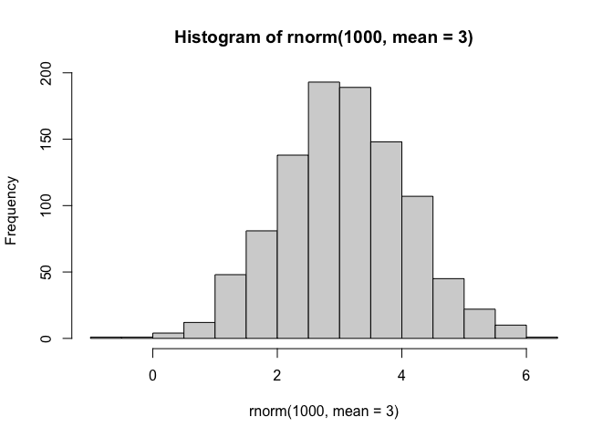

``` r
rnorm(30,-3)
```

     [1] -3.1621277 -2.0005014 -5.4298600 -2.1442623 -3.9296180 -3.0095546
     [7] -4.0086332 -2.1687412 -3.2015593 -3.2049033 -0.9292979 -2.0592482
    [13] -1.1031604 -3.3274051 -2.0769824 -2.0597350 -1.3506109 -2.5936462
    [19] -1.2394774 -3.0289686 -3.0591137 -0.9544939 -1.9619826 -3.2825672
    [25] -2.3277717 -3.0088122 -1.9908481 -1.9218838 -3.2956220 -2.4817501

``` r
rnorm(30,+3)
```

     [1] 2.2572319 2.9818193 3.5594825 4.3038764 3.2038133 3.2000705 2.9837600
     [8] 4.1261909 1.6552260 3.6855886 1.8552992 4.4954477 4.7708249 3.9571074
    [15] 1.6062378 2.2627313 2.3579162 4.6477136 2.3089855 1.3493443 0.6104246
    [22] 3.5222868 1.5438621 4.6176428 2.6315795 3.1462682 4.8394858 3.8761257
    [29] 3.5090505 3.2355021

``` r
x<-c(rnorm(30,-3), rnorm(30,+3))
```

``` r
z<-cbind(x=x,y=rev(x))
z
```

                    x           y
     [1,] -2.62944185  1.62857056
     [2,] -2.03732151  1.98159298
     [3,] -3.85643814  4.36326562
     [4,] -2.88784287  1.75468094
     [5,] -2.77814878  3.87496404
     [6,] -4.93177177  2.95476356
     [7,] -1.29463514  1.70616413
     [8,] -3.60422166  3.56357909
     [9,] -1.93461163  3.66943069
    [10,] -3.00912540  2.25662108
    [11,] -4.59411148  1.69307671
    [12,] -2.46125711  3.93366965
    [13,] -3.11124570  2.66349819
    [14,] -3.19737406  3.38616715
    [15,] -2.78327272  1.85067779
    [16,] -1.52802385  3.75199562
    [17,] -2.41590351  3.94182773
    [18,] -2.81126749  2.77274546
    [19,] -2.74455279 -0.05243961
    [20,] -2.47492000  1.94646814
    [21,] -4.75462250  3.78902240
    [22,] -4.64456047  4.72748464
    [23,] -2.96002338  2.19330292
    [24,] -2.62161795  2.15623111
    [25,] -2.31662211  2.81800383
    [26,] -2.06795994  3.76073355
    [27,] -2.84052028  2.98011006
    [28,] -3.78763975  2.41442892
    [29,] -4.67729962  3.45938066
    [30,] -2.25901470  3.44514666
    [31,]  3.44514666 -2.25901470
    [32,]  3.45938066 -4.67729962
    [33,]  2.41442892 -3.78763975
    [34,]  2.98011006 -2.84052028
    [35,]  3.76073355 -2.06795994
    [36,]  2.81800383 -2.31662211
    [37,]  2.15623111 -2.62161795
    [38,]  2.19330292 -2.96002338
    [39,]  4.72748464 -4.64456047
    [40,]  3.78902240 -4.75462250
    [41,]  1.94646814 -2.47492000
    [42,] -0.05243961 -2.74455279
    [43,]  2.77274546 -2.81126749
    [44,]  3.94182773 -2.41590351
    [45,]  3.75199562 -1.52802385
    [46,]  1.85067779 -2.78327272
    [47,]  3.38616715 -3.19737406
    [48,]  2.66349819 -3.11124570
    [49,]  3.93366965 -2.46125711
    [50,]  1.69307671 -4.59411148
    [51,]  2.25662108 -3.00912540
    [52,]  3.66943069 -1.93461163
    [53,]  3.56357909 -3.60422166
    [54,]  1.70616413 -1.29463514
    [55,]  2.95476356 -4.93177177
    [56,]  3.87496404 -2.77814878
    [57,]  1.75468094 -2.88784287
    [58,]  4.36326562 -3.85643814
    [59,]  1.98159298 -2.03732151
    [60,]  1.62857056 -2.62944185

``` r
plot(z)
```

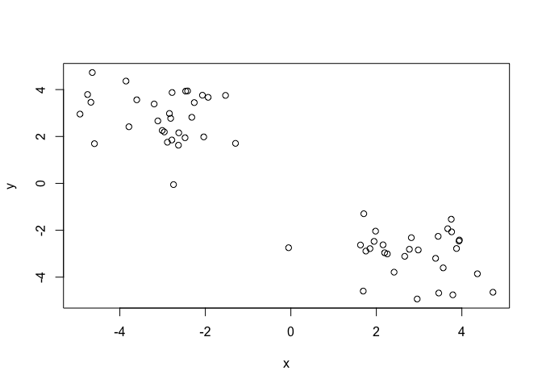

``` r
p<-1:5

cbind(p,p)
```

         p p
    [1,] 1 1
    [2,] 2 2
    [3,] 3 3
    [4,] 4 4
    [5,] 5 5

``` r
rbind(p,p)
```

      [,1] [,2] [,3] [,4] [,5]
    p    1    2    3    4    5
    p    1    2    3    4    5

``` r
rev(p)
```

    [1] 5 4 3 2 1

Now we can run`kmeans()` on this input `z` and see what the results look
like.

``` r
km<- kmeans(z, centers=2)
km
```

    K-means clustering with 2 clusters of sizes 30, 30

    Cluster means:
              x         y
    1 -3.000512  2.846172
    2  2.846172 -3.000512

    Clustering vector:
     [1] 1 1 1 1 1 1 1 1 1 1 1 1 1 1 1 1 1 1 1 1 1 1 1 1 1 1 1 1 1 1 2 2 2 2 2 2 2 2
    [39] 2 2 2 2 2 2 2 2 2 2 2 2 2 2 2 2 2 2 2 2 2 2

    Within cluster sum of squares by cluster:
    [1] 58.89148 58.89148
     (between_SS / total_SS =  89.7 %)

    Available components:

    [1] "cluster"      "centers"      "totss"        "withinss"     "tot.withinss"
    [6] "betweenss"    "size"         "iter"         "ifault"      

``` r
attributes(km)
```

    $names
    [1] "cluster"      "centers"      "totss"        "withinss"     "tot.withinss"
    [6] "betweenss"    "size"         "iter"         "ifault"      

    $class
    [1] "kmeans"

> Q. How many points are in each cluster?

``` r
km$size
```

    [1] 30 30

> Q. What “components of your result object details cluster
> assignment/membership?

``` r
 km$cluster
```

     [1] 1 1 1 1 1 1 1 1 1 1 1 1 1 1 1 1 1 1 1 1 1 1 1 1 1 1 1 1 1 1 2 2 2 2 2 2 2 2
    [39] 2 2 2 2 2 2 2 2 2 2 2 2 2 2 2 2 2 2 2 2 2 2

> Q. What “components of your result object details cluster center

``` r
km$centers
```

              x         y
    1 -3.000512  2.846172
    2  2.846172 -3.000512

> Q. Plot `z` colored by the kmeans cluster assignment and add cluster
> centers as blue points

``` r
plot(z, col=c("red","blue"))
```

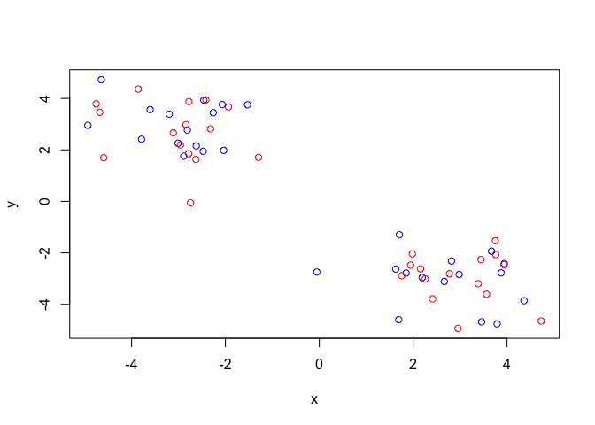

``` r
plot(z, col=2)
```

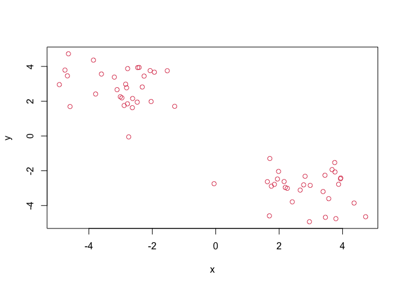

``` r
plot(z, col=c(1,2))
```

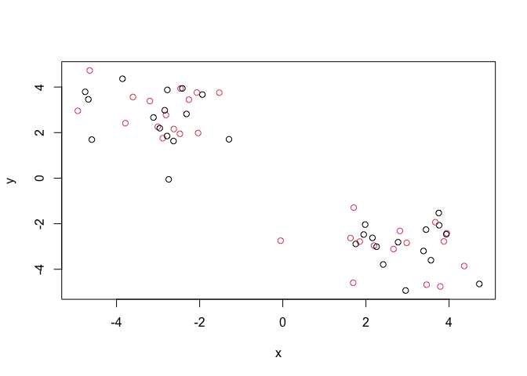

``` r
plot(z, col=km$cluster)
points (km$centers, col="blue", pch=15)
```

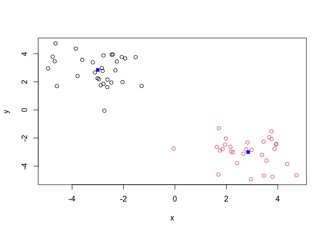

> Q. Run a K-means clustering and ploit the results asking for 4
> clusters (K=4)

``` r
km4<- kmeans(z,centers=4)
plot(z, col=km4$cluster)
points(km4$centers, col="blue",pch=15,cex=2 )
```

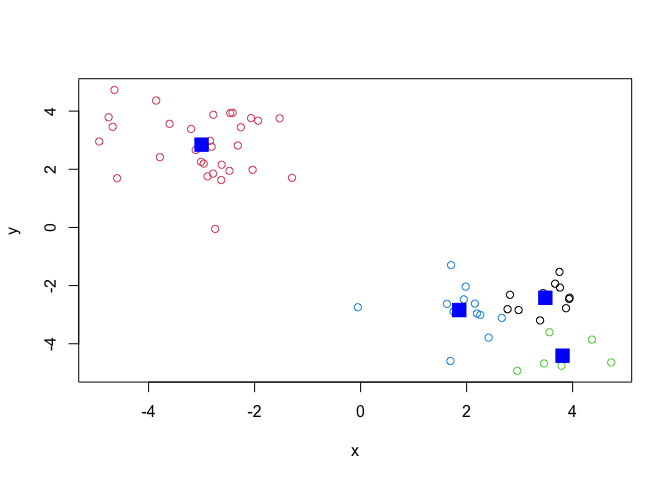

> **N.B**. You need to tell K-means the number of clusters(i.e. set
> `center=2`)!!

one approach is to try different valurs for `centers` and then pick the
best…

``` r
ans<- NULL
for(i in 1:10){
km<- kmeans(z, centers=i)
ans<-c(ans,km$tot.withinss)
}
plot(ans,type="o",
     xlab="Number of clusters",
    ylab="Total Sum of squares Distance")
```

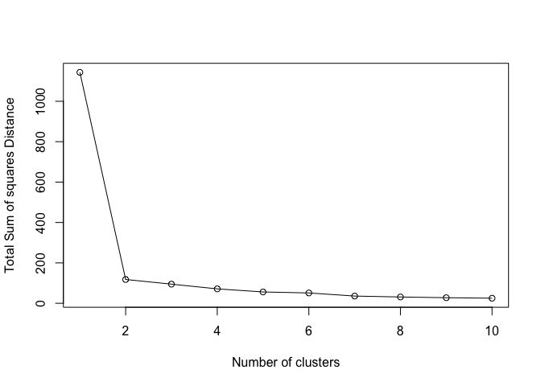

## Heirarchial Clustering

The main function in “base: R Heirachial Clusrering is called `hclust()`

This function does not take your “raw” data for clustering. You must
first build a “distance matrix” from your data and pass this as input to
`hclust()`

``` r
d<-dist(z)
hc<-hclust(d)
hc
```


    Call:
    hclust(d = d)

    Cluster method   : complete 
    Distance         : euclidean 
    Number of objects: 60 

There is a bespoke `plot()` method for `hclust()` result objects.

``` r
plot(hc)
abline(h=8, col="red")
```

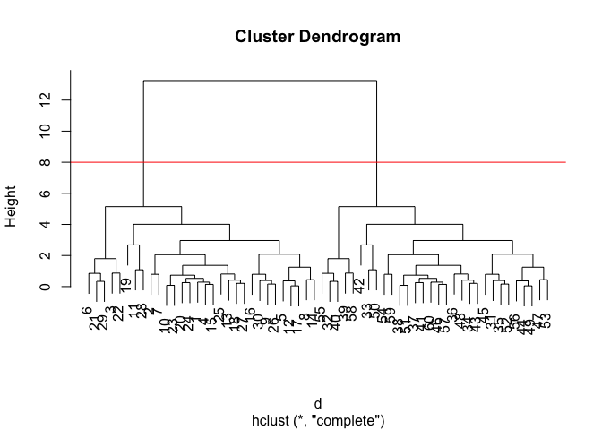

Once we have our `hclust` object( our “tree” of “cluster dendrogram”) we
can *“cut”* the tree to reval the clustering pattern

``` r
cutree(hc, h=8)
```

     [1] 1 1 1 1 1 1 1 1 1 1 1 1 1 1 1 1 1 1 1 1 1 1 1 1 1 1 1 1 1 1 2 2 2 2 2 2 2 2
    [39] 2 2 2 2 2 2 2 2 2 2 2 2 2 2 2 2 2 2 2 2 2 2

``` r
cutree(hc, k=4)
```

     [1] 1 1 2 1 1 2 1 1 1 1 1 1 1 1 1 1 1 1 1 1 2 2 1 1 1 1 1 1 2 1 3 4 3 3 3 3 3 3
    [39] 4 4 3 3 3 3 3 3 3 3 3 3 3 3 3 3 4 3 3 4 3 3

> Q.Make a plot of `z` with your hclust results(i.e. colored by cluster
> membership)

``` r
grps<- cutree(hc, k=2)
plot(z, col=grps)
```

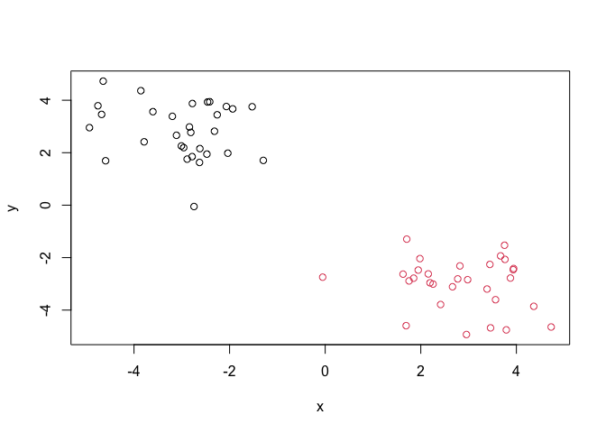

## Hands on with PCA

Principal Component Analysis(PCA) PCA is a dimensionality reduction
method that is popular for revaling patterns in complex data sets

### Analysis of UK food data

Lest look at some data on eating habits of folks from the UK to see if
there are patterns and trends that have some regions being distinct from
others.

## Data Import

The data is made available in CSV format so we can use the `read.csv()`

``` r
url<- "https://tinyurl.com/UK-foods"
x <- read.csv(url)
dim(x)
```

    [1] 17  5

``` r
head(x)
```

                   X England Wales Scotland N.Ireland
    1         Cheese     105   103      103        66
    2  Carcass_meat      245   227      242       267
    3    Other_meat      685   803      750       586
    4           Fish     147   160      122        93
    5 Fats_and_oils      193   235      184       209
    6         Sugars     156   175      147       139

> Q. How many rows and columns are in your new data frame named x? What
> R functions could you use to answer this questions?

``` r
dim(x) 
```

    [1] 17  5

``` r
x <- read.csv(url, row.names=1)
head(x)
```

                   England Wales Scotland N.Ireland
    Cheese             105   103      103        66
    Carcass_meat       245   227      242       267
    Other_meat         685   803      750       586
    Fish               147   160      122        93
    Fats_and_oils      193   235      184       209
    Sugars             156   175      147       139

> Q2. Which approach to solving the ‘row-names problem’ mentioned above
> do you prefer and why? Is one approach more robust than another under
> certain circumstances?

I prefer using read.csv (url, row.names = 1) because it tells R that the
first column should be used as row names. It’s cleaner and less error
prone than importing the column first and then manually removing it.

``` r
# Note how the minus indexing works
rownames(x) <- x[,1]
x <- x[,-1]
head(x)
```

        Wales Scotland N.Ireland
    105   103      103        66
    245   227      242       267
    685   803      750       586
    147   160      122        93
    193   235      184       209
    156   175      147       139

``` r
x <- read.csv(url, row.names=1)
head(x)
```

                   England Wales Scotland N.Ireland
    Cheese             105   103      103        66
    Carcass_meat       245   227      242       267
    Other_meat         685   803      750       586
    Fish               147   160      122        93
    Fats_and_oils      193   235      184       209
    Sugars             156   175      147       139

``` r
barplot(as.matrix(x), beside=T, col=rainbow(nrow(x)))
```


``` r
barplot(as.matrix(x), beside=F, col=rainbow(nrow(x)))
```

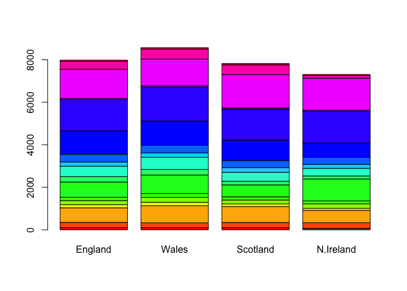

Changing beside = TRUE to beside = FALSE makes the stacked barplot.

``` r
dim(x)
```

    [1] 17  4

``` r
head(x)
```

                   England Wales Scotland N.Ireland
    Cheese             105   103      103        66
    Carcass_meat       245   227      242       267
    Other_meat         685   803      750       586
    Fish               147   160      122        93
    Fats_and_oils      193   235      184       209
    Sugars             156   175      147       139

## Tidy the data

Fix anything that went wrong with data import.

``` r
library(tidyr)

# Convert data to long format for ggplot with `pivot_longer()`
x_long <- x |> 
          tibble::rownames_to_column("Food") |> 
          pivot_longer(cols = -Food, 
                       names_to = "Country", 
                       values_to = "Consumption")

dim(x_long)
```

    [1] 68  3

``` r
head(x_long)
```

    # A tibble: 6 × 3
      Food            Country   Consumption
      <chr>           <chr>           <int>
    1 "Cheese"        England           105
    2 "Cheese"        Wales             103
    3 "Cheese"        Scotland          103
    4 "Cheese"        N.Ireland          66
    5 "Carcass_meat " England           245
    6 "Carcass_meat " Wales             227

# Create grouped bar plot

``` r
library(ggplot2)
```

``` r
ggplot(x_long) +
  aes(x = Country, y = Consumption, fill = Food) +
  geom_col() +
  theme_bw()
```


``` r
ggplot(x_long) +
  aes(x = Country, y = Consumption, fill = Food) +
  geom_col(position = "dodge") +
  theme_bw()
```


``` r
ggplot(x_long) +
  aes(x = Country, y = Consumption, fill = Food) +
  geom_col(position = "stack") +
  theme_bw()
```


Changing geom_col(position = “dodge”) to geom_col(position = “stack”),
or just geom_col(), makes the stacked barplot.

> . Q5: We can use the pairs() function to generate all pairwise plots
> for our countries. Can you make sense of the following code and
> resulting figure? What does it mean if a given point lies on the
> diagonal for a given plot?

A point on the diagonal means that the two countries have similar
consumption values for that food category. The pairs plot compares each
country against every other country to show similarities and differences
in food consumption patterns.

``` r
pairs(x, col=rainbow(nrow(x)), pch=16)
```


``` r
 library(pheatmap)

pheatmap( as.matrix(x) )
```


## Exporatory analysis

Make some plots to help make sense of obvious trends…

> Q6. Based on the pairs and heatmap figures, which countries cluster
> together and what does this suggest about their food consumption
> patterns? Can you easily tell what the main differences between N.
> Ireland and the other countries of the UK in terms of this data-set?

England, Wales, and Scotland cluster more together, meaning they have
more similar food consumption patterns. Northern Ireland looks more
different from the others, but it is hard to tell exactly which foods
drive the difference from only the pairs plot and heatmap.

\##PCA

``` r
pca <- prcomp( t(x) )
summary(pca)
```

    Importance of components:
                                PC1      PC2      PC3       PC4
    Standard deviation     324.1502 212.7478 73.87622 2.921e-14
    Proportion of Variance   0.6744   0.2905  0.03503 0.000e+00
    Cumulative Proportion    0.6744   0.9650  1.00000 1.000e+00

The returned `pca` object has components that we can use to make our
result figures:

``` r
attributes(pca)
```

    $names
    [1] "sdev"     "rotation" "center"   "scale"    "x"       

    $class
    [1] "prcomp"

the main result figure from this analysis is called a “PC score plot” or
” orientation ploy” “PC plot” or “PC1 vs PC2 plot”.

``` r
library(ggplot2)

ggplot(pca$x)+
  aes(PC1, PC2)+
  geom_point()
```


``` r
mycols<-c("orange","red","blue","darkgreen")
ggplot(pca$x)+
  aes(PC1, PC2)+
  geom_point(col=mycols)
```


``` r
ggplot(pca$x)+
  aes(PC1, PC2,label=row.names(pca$x))+
  geom_point(col=mycols)+
  geom_text(size=2, vjust=2, col=mycols)
```

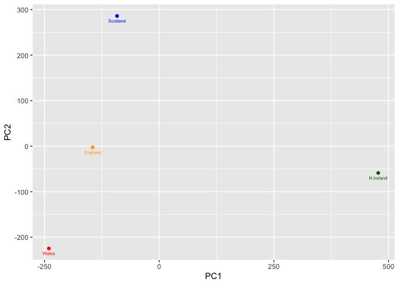

``` r
ggplot(pca$rotation)+
  aes(x= PC1,
      y= reorder(row.names(pca$rotation),PC1))+
  geom_col()
```

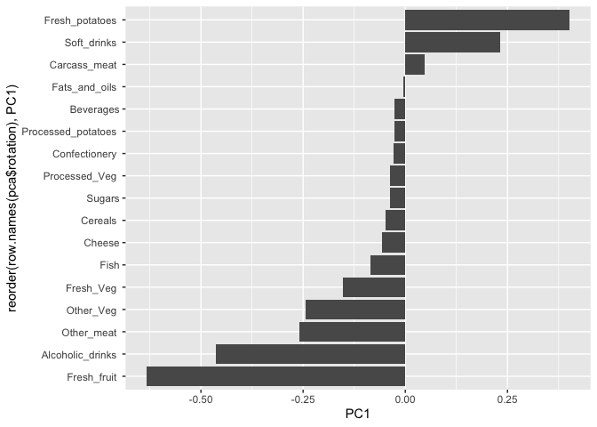

``` r
ggplot(pca$rotation) +
  aes(x = PC1, y = reorder(rownames(pca$rotation), PC1)) +
  geom_col() +
  xlab("PC1 Loading Score") +
  ylab("") +
  theme_bw()
```

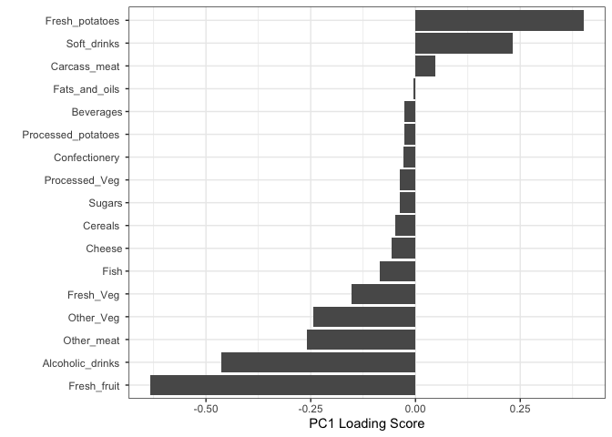

``` r
ggplot(pca$rotation) +
  aes(x = PC2, y = reorder(rownames(pca$rotation), PC2)) +
  geom_col() +
  xlab("PC2 Loading Score") +
  ylab("") +
  theme_bw()
```

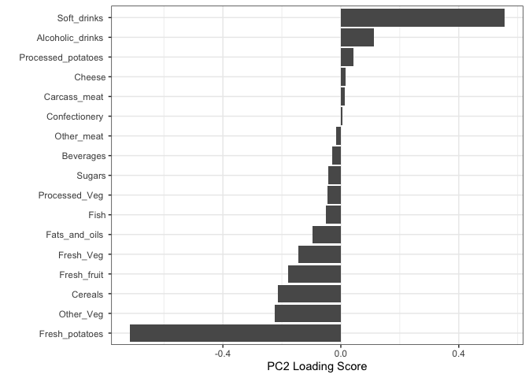

PC2 mainly separates the countries based on the foods with the largest
positive and negative loading scores. The most important foods are the
ones with the longest bars on the PC2 loading plot.

``` r
url2 <- "https://tinyurl.com/expression-CSV"
rna.data <- read.csv(url2, row.names = 1)

dim(rna.data)
```

    [1] 100  10

``` r
pca <- prcomp(t(rna.data), scale = TRUE)

df <- as.data.frame(pca$x)
df$Sample <- rownames(df)

ggplot(df) +
  aes(x = PC1, y = PC2, label = Sample) +
  geom_point(size = 3) +
  geom_text(vjust = -0.5, size = 3) +
  xlab("PC1") +
  ylab("PC2") +
  theme_bw()
```

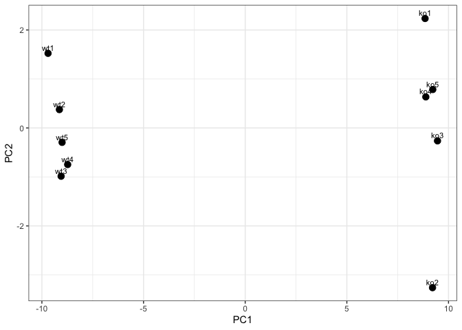

``` r
summary(pca)
```

    Importance of components:
                              PC1    PC2     PC3     PC4     PC5     PC6     PC7
    Standard deviation     9.6237 1.5198 1.05787 1.05203 0.88062 0.82545 0.80111
    Proportion of Variance 0.9262 0.0231 0.01119 0.01107 0.00775 0.00681 0.00642
    Cumulative Proportion  0.9262 0.9493 0.96045 0.97152 0.97928 0.98609 0.99251
                               PC8     PC9    PC10
    Standard deviation     0.62065 0.60342 3.3e-15
    Proportion of Variance 0.00385 0.00364 0.0e+00
    Cumulative Proportion  0.99636 1.00000 1.0e+00

There are 100 genes and 10 samples. PC1 gives a useful overview because
it explains 92.6% of the variation, and PC1 plus PC2 explain 94.9%
total.
